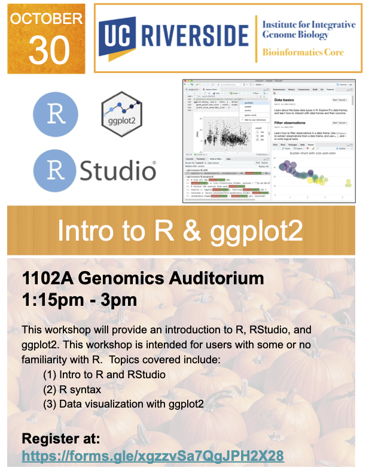

# Intro-to-R-RStudio

<figure>

</figure>

This workshop will provide an introduction to R, RStudio and data visualization using ggplot2. This workshop is intended for beginner users with some or no familiarity with R. Topics covered in this workshop includes:

- R and RStudio interface  
- R Syntax  
- Visualization using ggplot2  

# General Information  
**Date:** October 30, 2024  
**Time:** 1:15PM - 3PM  
**Location:** 1102A Genomics Building   
**Format:** In-Person

# Registration
Register for the workshop at: https://forms.gle/xgzzvSa7QgJPH2X28

# Software installation
We will be using OnDemand to access the cluster. There's no need to have R or RStudio installed on your computer.  
The only requirement is an up-to-date web browser and WiFi access. 

# Workshop Resources
All materials for the workshop are available at the GitHub Repository:
https://github.com/bioinformatics-workshop/

# Requirements
Attendees should have a laptop (Mac or PC) to follow along in the workshop. If you don’t have a laptop, you can check one out at the [Tomas Rivera](https://library.ucr.edu/libraries/tomas-rivera-library) or [Orbach Science Library](https://library.ucr.edu/libraries/orbach-science-library). Go to the library circulation desk for more information.

